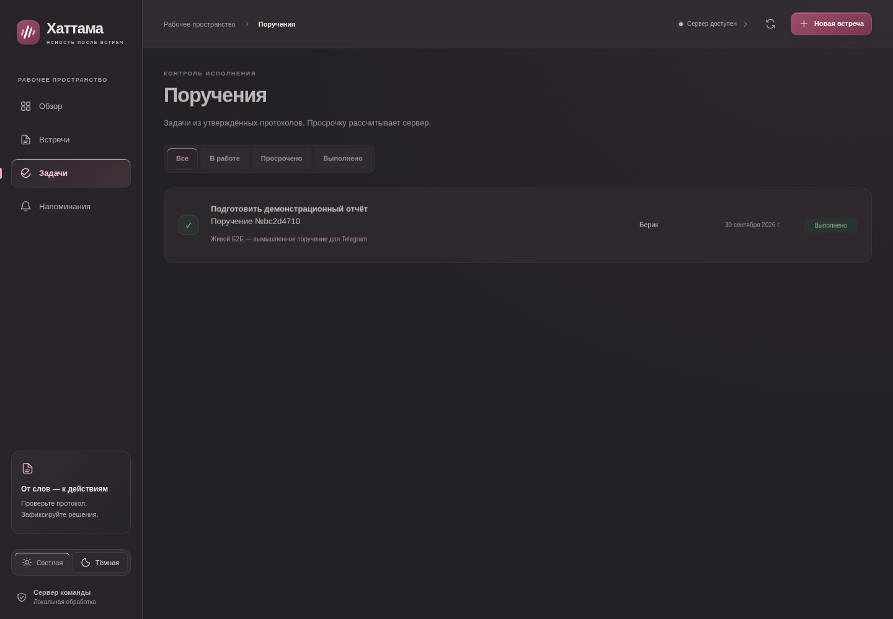
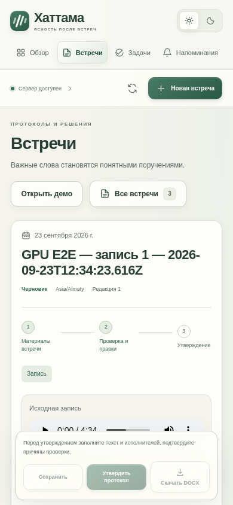
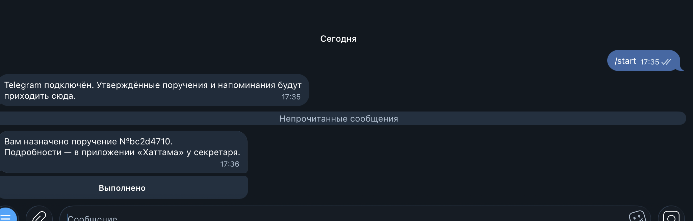
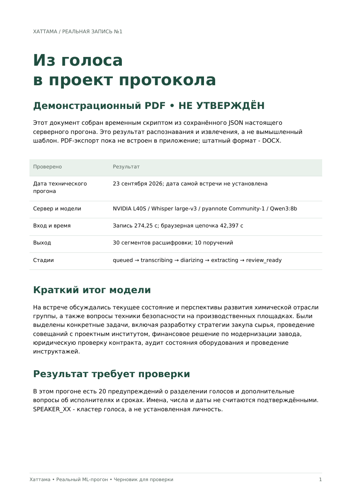
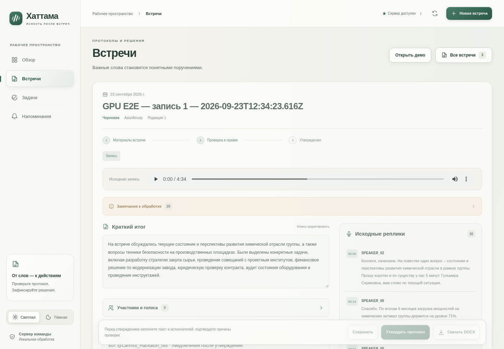
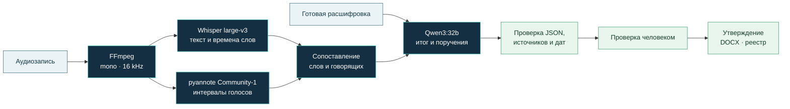

<p align="center">
  
</p>

<p align="center"><strong>Запись → расшифровка → поручения → проверка → утверждённый документ</strong></p>

<p align="center">
  <a href="#быстрый-запуск">Запустить</a> ·
  <a href="output/pdf/hatama-real-audio-draft.pdf">Открыть PDF</a> ·
  <a href="#реальный-результат-аудио-в-проект-протокола">Пример распознавания</a> ·
  <a href="#результаты-ml">Результаты ML</a> ·
  <a href="#как-устроен-ml">Архитектура</a> ·
  <a href="#демонстрация-за-три-минуты">Показать жюри</a> ·
  <a href="docs/REQUIREMENTS_STATUS.md">Соответствие ТЗ</a>
</p>

---

**[📄 Открыть PDF из реального серверного прогона](output/pdf/hatama-real-audio-draft.pdf)** — 4 страницы: итог встречи, реплики с голосами и временем, 10 поручений. Демонстрационный черновик, не утверждённый протокол.

**До защиты осталась минута? [Сценарий показа на 60 секунд](docs/DEMO_QUICK.md)** — PDF, скриншот, готовые тезисы и ответы на вопросы; доступно без запуска GPU.

## Совещание заканчивается. Ответственность остаётся.

После встречи нужно восстановить, **что решили, кто отвечает и к какому сроку**. На смешанной русско-казахской записи к этому добавляются смены языка, неясные имена и относительные сроки. Ошибка в одном поле превращается в чужое поручение или выдуманную дату.

**Хаттама** превращает запись или текст встречи в проект протокола, который можно проверить по исходным репликам. Секретарь уточняет исполнителей и сроки, сохраняет правки и утверждает документ. Команда получает DOCX, реестр поручений и локальные напоминания.

Интерфейс включает обзор встреч и сроков, светлую и тёмную темы, поиск и закреплённую панель проверки. Дополнительный Telegram-канал связывает участника с ботом, доставляет назначения после утверждения и возвращает статус «Выполнено». Он выключен по умолчанию; [настройка и правила передачи данных](docs/TELEGRAM.md).

| Для секретаря | Для руководителя | Для команды |
| --- | --- | --- |
| Расшифровка и проект поручений вместо чистого листа | У каждой задачи есть подтверждающие реплики | Исполнитель, срок и статус собраны в реестре |
| Переход от поручения к месту в записи | Неясные поля явно требуют проверки | Утверждённая версия сохраняется отдельно |

> **Принцип продукта:** модель готовит проект, человек подтверждает результат. `review_ready` означает готовность к проверке, а не автоматически достоверный протокол.

## Приложение в работе

**Проверка протокола рядом с исходными репликами.** Запись, краткий итог, участники и замечания доступны на одном экране; перед утверждением спорные поля нужно проверить.


<table>
  <tr>
    <td width="72%" valign="top">
      <strong>Реестр поручений · тёмная тема</strong><br/>
      <br/>
      Исполнитель, срок и статус. Здесь показано вымышленное проверочное поручение, завершённое через живой Telegram-бот.
    </td>
    <td width="28%" valign="top" align="center">
      <strong>Проверка с телефона</strong><br/>
      <br/>
      Адаптивный экран и закреплённая панель действий.
    </td>
  </tr>
</table>

Это настоящие снимки развёрнутого приложения из [серверной приёмки](docs/SERVER_E2E_REPORT.md), без имитации интерфейса. Аудио на desktop/mobile получено в историческом прогоне **Whisper large-v3 + Community-1 + Qwen3:8b**; эти изображения не выдаются за результат финального профиля 32B. Настоящие аудиопротоколы на снимках остаются черновиками.

### Живой Telegram



Скриншот предоставлен пользователем и сохранён без изменений. Бот подтверждает подключение и доставляет нейтральное уведомление с кнопкой **«Выполнено»**; детали поручения остаются в приложении. Возврат статуса в реестр и сохранность после перезапуска подтверждены в [серверном отчёте](docs/SERVER_E2E_REPORT.md).

### Сравнить документы по одной записи

| Документ | Назначение | Открыть |
| --- | --- | --- |
| **Пример из задания · запись №1** | Предоставленный организаторами протокол для сравнения; не пословная разметка аудио | [PDF примера](docs/artifacts/reference-meeting-1.pdf) |
| **Фактический ML-черновик · запись №1** | Результат моделей на том же входе; требует проверки, не является утверждённым протоколом | [PDF результата модели](docs/artifacts/model-meeting-1.pdf) |

Эти PDF — материалы для просмотра и сравнения. Встроенный пользовательский экспорт приложения остаётся **DOCX**; наличие файлов в репозитории не означает появления PDF-endpoint или автоматического утверждения результата.

В исходном примере есть расхождения с записью, поэтому он не использован как подсказка модели или эталон для расчёта WER. В PDF результата сохранены реальные ошибки и предупреждения — это демонстрация полученного черновика.

## Реальный результат: аудио в проект протокола

**Да, у нас есть сохранённые результаты настоящих серверных запусков.** Ниже показан браузерный прогон записи №1 на Brev / NVIDIA L40S от 23 сентября 2026 года: загрузка через React → FastAPI → Whisper large-v3 → pyannote Community-1 → Ollama Qwen3:8b → сохранённый проект протокола.

**[Открыть демонстрационный PDF — 4 страницы](output/pdf/hatama-real-audio-draft.pdf)** · **[Посмотреть исходный JSON-фрагмент](docs/examples/real-audio-excerpt.json)** · **[Отчёт о серверной приёмке](docs/SERVER_E2E_REPORT.md)**

> PDF собран **временным скриптом из реального сохранённого JSON**, без нового запуска GPU. Это демонстрация результата обработки, **не встроенная функция PDF-экспорта и не утверждённый протокол**. Штатный экспорт приложения — DOCX. Предупреждения, неизвестные исполнители и отсутствующие даты сохранены. Пример относится к прогону **8B**, а результаты последующих улучшений **32B** приведены отдельно ниже; версии не смешиваются.

<a href="output/pdf/hatama-real-audio-draft.pdf"></a>

### Что сделано и проверено целиком

| Компонент | Реализовано | Подтверждение |
| --- | --- | --- |
| Frontend | Загрузка аудио/текста, стадии, редактор, источники, темы, мобильная версия | Две реальные записи загружены через браузер; результат появился без перезагрузки |
| Backend | API, очередь, SQLite, версии, сохранение аудио, HTTP Range, восстановление | Реальный проход до `review_ready`, данные сохранены после перезапуска |
| ML | Распознавание, кластеры голосов, summary, поручения и проверка оснований | Настоящие Whisper + pyannote + Qwen на L40S; исходные результаты сохранены |
| Протокол | Проверка, утверждение, снимок документа, DOCX | На известном вымышленном тексте: настоящий Qwen → проверка в UI → утверждение → скачанный DOCX |
| Telegram | Привязка по одноразовой ссылке и числовому ID, доставка, кнопка «Выполнено» | Пользователь получил живое уведомление и нажал кнопку; в приложении появился `done`, revision=3 |
| Развёртывание | Собранный UI раздаётся FastAPI; модели и данные на сервере | systemd `hatama.service`, доступ через SSH-туннель; после перезапуска привязка и статус сохранены, DOCX не изменился |
| Автоматические проверки | Backend/SQLite/контракты и браузерные сценарии с подменами моделей | 88 backend-тестов + 5 subtests; 35 Playwright-сценариев. Отдельно от настоящего ML |

В живом Telegram-тесте отправлено одно нейтральное уведомление, без текста встречи. Проверка с реальным ботом использовала **вымышленное поручение**; протоколы настоящих аудиозаписей не утверждались автоматически.

### Конкретный результат браузерного прогона

| Запись | Длительность аудио | Время цепочки с действиями браузера | Сегменты | Поручения |
| --- | ---: | ---: | ---: | ---: |
| №1 | 274,25 с | **42,397 с** | 30 | 10 |
| №2 | 206,03 с | **33,590 с** | 32 | 8 |

Обе встречи прошли `queued → transcribing → diarizing → extracting → review_ready`. JavaScript-ошибок в этом прогоне не было. Это измерения конкретной серверной приёмки **Qwen3:8b**, а не обещание скорости для любой записи. Дата исходных встреч не установлена; дата теста не используется как подтверждённая дата встречи.

### Как распарсили голос

Дословный фрагмент сохранённого результата №1; ошибки распознавания и границы реплик здесь не исправлялись:

| Время | Кластер голоса | Распознанный текст |
| --- | --- | --- |
| 00:00.00–00:14.90 | `SPEAKER_02` | Коллеги, начинаем. На повестке один вопрос – состояние и перспективы развития химической отрасли в рамках группы. Прошу коротко и по существу у нас 5 минут. Гульмира Сериковна, вам слово по текущей ситуации. |
| 00:14.90–00:34.88 | `SPEAKER_00` | Спасибо. По итогам 9 месяцев загрузка мощностей на химических активах группы держится на уровне 71%. Основная проблема – устаревшее оборудование на двух площадках и отсутствие единой стратегии закупа сырья. Мы |
| 00:34.88–00:39.60 | `SPEAKER_00` | теряем на логистике до 8% от себестоимости продукции. |
| 00:39.82–00:43.80 | `SPEAKER_02` | Понятно. Тимур Булатович, что у вас по инвестпроектам? |

`SPEAKER_02` снова появляется после `SPEAKER_00`: модель выделяет голосовые кластеры, а не просто нумерует реплики. **Имя человека этим не доказано** — связь голоса с участником проверяется отдельно.

Из реплики **01:16.48–01:36.34** извлечено поручение:

```json
{
  "title": "Разработать единую стратегию закупа сырья для химических активов группы",
  "assignee": "Гульмира Сериковна",
  "due_text": "срок до 15 октября",
  "due_date": null,
  "review_reasons": ["deadline_needs_review"]
}
```

Это сокращённое представление фактического ответа: полный ID задачи и ссылка на исходную реплику есть в [JSON-примере](docs/examples/real-audio-excerpt.json). Календарная дата осталась `null`: год не подтверждён. Во всём прогоне №1 есть 20 предупреждений о голосах и дополнительные вопросы об исполнителях/сроках; качество требует сверки с записью.

### Как результат выглядит в приложении



PDF содержит итог, пять фрагментов расшифровки с голосами и временем, все десять извлечённых поручений, ссылки на времена источников и замечания к проверке. Meeting ID, версия прогона и SHA-256 исходного JSON указаны внутри документа. Полные служебные JSON и скриншоты остаются в локальном `artifacts/server-e2e/`; в репозиторий добавлены только выбранные демонстрационные материалы.

## Результаты ML

**Проверено 23 сентября 2026 года на арендованном Linux-сервере Brev с NVIDIA L40S, класс 48 GB VRAM.** Настоящие модели запускались на сервере; Mac использовался для разработки, Git, подключения и просмотра результатов.

| Проверка | Результат | Что именно подтверждено |
| --- | ---: | --- |
| **Qwen3:32b**, RU/KZ/смешанный синтетический текст, набор v2 | **8 / 8 · 100% сценариев** | По ручной сверке проверенных полей: состав поручений, исполнитель, срок и основания |
| Qwen3:8b, тот же набор v2 | 4 / 8 · 50% сценариев | Базовый вариант для сравнения; поэтому рекомендована 32B |
| Покрытие обязательного минимума ТЗ | **≈71%** | 3 пункта подтверждены, 4 частичны; частичный пункт имеет вес 0,5. [Методика](docs/REQUIREMENTS_STATUS.md) |
| Модульные ML-регрессии на сервере | **48 / 48** | Источники, даты, исполнители, отрицания, привязка голосов и восстановление речи |
| Проверка объединённой версии | **120 backend + 31 subtest** | После объединения ML, frontend и Telegram: все backend-тесты и сборка frontend прошли на сервере; 48 ML-тестов входят в этот набор |
| Отдельная серверная приёмка приложения | **88 backend + 35 E2E** | Проверки коллеги на указанной в [отчёте](docs/SERVER_E2E_REPORT.md) версии; также подтверждён живой Telegram на вымышленном примере |
| Две предоставленные аудиозаписи | **2 / 2 полных прохода** | Настоящие Whisper → pyannote → Ollama завершили обработку |
| Реальное аудио через HTTP API | `review_ready` | Исходный прогон №1 и финальный прогон №2: загрузка, очередь, стадии ML и сохранение результата |
| Казахское аудио: 3 фразы FLEURS, 43,14 с | **WER 32,08%** | 17 словных правок на 53 слова. Малый тест чтения живыми дикторами; не оценка качества совещаний |
| WER / DER на предоставленных встречах | **Не измерены** | Нет независимой проверенной пословной и голосовой разметки |

**100% относится только к восьми проверенным синтетическим текстовым сценариям.** Это не оценка точности на произвольных встречах и не результат проверки казахского аудио. Эталоны сценариев используются при оценке, а не передаются модели. Набор небольшой и использовался при разработке; независимую оценку на новых встречах ещё предстоит провести.

Финальные полные аудиопрогоны с **Qwen3:32b** и восстановлением речевых пропусков:

| Запись | Длина записи | Весь ML-проход | ASR | Диаризация |
| --- | ---: | ---: | ---: | ---: |
| №1 | 274,25 с | **56,04 с** | 16,19 с | 5,90 с |
| №2 | 206,03 с | **47,54 с** | 14,63 с | 5,22 с |

Во второй записи повторный ASR занял ещё 3,79 с и восстановил пропущенное поручение о смете. В финальных протоколах остаются ошибочный исполнитель, пропущенное обязательство и потерянные сроки: **автоматический результат требует проверки**. Завершение обработки не заменяет прослушивание и сверку. **[Итоговый отчёт ML](docs/ML_QUALITY_REPORT.md)** содержит исходный baseline и результаты улучшений; [ML_SETUP.md](docs/ML_SETUP.md) — настройки и версии; [ML_MODEL_RESEARCH.md](docs/ML_MODEL_RESEARCH.md) — исследованные альтернативы.

## Как устроен ML



| Этап | Реализация | Почему это важно |
| --- | --- | --- |
| Подготовка записи | FFmpeg → PCM WAV, mono, 16 kHz | Одинаковый вход для распознавания и диаризации |
| Распознавание | `faster-whisper`, Whisper **large-v3**, CUDA, `int8_float16`, VAD, времена слов | Текст и его положение в записи; смешанная речь требует отдельной оценки |
| Разделение голосов | **pyannote Community-1**, exclusive diarization | Кластеры голосов и границы реплик; кластер сам по себе не является именем |
| Извлечение | **Ollama + Qwen3:32b**, без thinking, JSON Schema | Итог, поручения, предполагаемые исполнители и дословные формулировки сроков |
| Валидация | Python, проверка ссылок на реплики, детерминированный разбор дат | Несуществующий источник отклоняется; отсутствующие сведения требуют проверки |
| Утверждение | Редактор → `revision` → отдельный снимок | Экспортируется сохранённая утверждённая версия |

### Что улучшено

- **Более сильная локальная LLM.** Qwen3:32b выбрана после сравнения с 8B на одном наборе текстовых сценариев.
- **Короткие ссылки для модели.** Внутри запроса используются `S1`, `S2` и далее; перед проверкой они возвращаются к исходным ID. Неизвестные ссылки не подменяются подходящими.
- **Календарную дату вычисляет код.** Модель возвращает дословный `due_text`, а поле `due_date` в её ответе — `null`. Приложение распознаёт полную дату из подтверждённой цитаты. Год не дополняется из даты запуска.
- **Проверка исполнителя стала строже.** Голосовой `SPEAKER_00` не принимается за имя. Поддержаны дополнительные русские и казахские обязательства от первого лица; добавлены проверки вопросов и явных отрицаний.
- **Сохранены предупреждения при сопоставлении речи.** Слова нулевой длительности и неуверенная привязка к голосу остаются видимыми для проверки, в том числе после объединения слов в реплику.
- **Результаты можно воспроизвести.** Отчёты содержат конфигурацию, сведения о моделях, хеш входа и ML-адаптера, ревизию Git при её доступности и длительности этапов.

Это улучшения извлечения и проверки результата. Они не означают, что модель безошибочно понимает любую формулировку отрицания или всегда правильно узнаёт говорящего. Дополнительное восстановление пропусков ASR включается отдельно через `ASR_GAP_RECOVERY`; по умолчанию оно выключено, восстановленный текст помечается для проверки. Его результаты — в [отчёте ML](docs/ML_QUALITY_REPORT.md).

### Почему сейчас без дообучения

У команды две предоставленные встречи. Обучение на них с последующей оценкой на тех же записях не показало бы качество на новых совещаниях. На этом этапе мы сравнили готовые модели и улучшили обработку источников, сроков и неопределённости. Следующий шаг — отдельный размеченный набор RU, KZ и смешанных записей с новыми говорящими; затем измерение WER/DER и решение о дообучении. [Исследование моделей и ограничений](docs/ML_MODEL_RESEARCH.md).

## Быстрый запуск

### 1. Открыть готовое demo без моделей

Нужны **Python 3.12** и **Node.js ≥22**. Demo использует заранее подготовленные вымышленные данные: оно показывает возможности продукта без GPU и скачивания весов.

Из корня репозитория, первый терминал:

```bash
python3.12 -m venv .venv
.venv/bin/python -m pip install -r backend/requirements.txt
.venv/bin/uvicorn backend.app.main:app --host 127.0.0.1 --port 8000
```

Во втором терминале:

```bash
cd frontend
npm ci
npm run build
npm run dev
```

Откройте **[http://127.0.0.1:5173](http://127.0.0.1:5173)** и нажмите **«Открыть демо»**. Интерфейс явно помечает вымышленные данные. Каждый запуск создаёт отдельную встречу.

После сборки FastAPI также раздаёт `frontend/dist`: **[http://127.0.0.1:8000](http://127.0.0.1:8000)** работает без Vite. `npm run preview` предназначен для просмотра статики и не настраивает API proxy.

Данные по умолчанию сохраняются в `data/`; для отдельного стенда задайте `DATA_DIR`. Корневой `.env` загружается автоматически, переменные окружения имеют приоритет. Рабочие записи не нужно удалять для повторного показа.

### 2. Настроить настоящее ML на сервере

**Все команды моделей, ML-прогонов и ML-тестов выполняются на арендованном сервере.** С компьютера разработчика только подключитесь:

```bash
brev shell hatama-ml-gpu
```

В SSH-сессии перейдите в корень серверного checkout. Подготовьте окружение, CUDA и веса по [ML_SETUP.md](docs/ML_SETUP.md), затем используйте профиль:

```bash
# Только на Linux GPU-сервере, из корня проекта.
nvidia-smi
export ASR_MODEL="$PWD/models/gpu/asr"
export DIARIZATION_MODEL_PATH="$PWD/models/gpu/diarization"
export ASR_DEVICE=cuda
export ASR_COMPUTE_TYPE=int8_float16
export ASR_GAP_RECOVERY=true
export OLLAMA_BASE_URL=http://127.0.0.1:11434
export OLLAMA_MODEL=qwen3:32b
export OLLAMA_THINKING=false

ollama pull qwen3:32b
eval/.venv/bin/python scripts/check_models.py --strict
eval/.venv/bin/uvicorn backend.app.main:app --host 127.0.0.1 --port 8000
```

Ollama должна быть запущена на том же сервере. Веса подготавливаются отдельно; inference не скачивает их при отсутствии. Для Community-1 требуется принятие условий доступа владельцем аккаунта. `/api/health` показывает готовность провайдеров, а не точность моделей.

UI подключается к серверному backend через SSH-туннель; подробности — в [инструкции backend](backend/INTEGRATION_HANDOFF.md). У MVP нет авторизации пользователей, поэтому обычный запуск слушает loopback. Публичное размещение требует отдельной настройки доступа.

## Как проверить решение

### Настоящие модели — на Brev

После `brev shell hatama-ml-gpu`, из корня подготовленного серверного checkout:

```bash
# Извлечение на фиксированном синтетическом наборе RU/KZ/RU-KZ.
eval/.venv/bin/python scripts/evaluate_extraction.py \
  --cases eval/text_quality_cases.json \
  --model qwen3:32b \
  --output eval/results/reproduce-qwen3-32b.json

# Настоящая запись: ASR + диаризация + LLM, с диагностикой.
eval/.venv/bin/python scripts/run_ml_checkpoint.py eval/audio/meeting-1.mp3 \
  --occurred-at 2026-09-23 --seconds 3600 --min-speakers 2 \
  --full --diagnostics --output eval/results/reproduce-meeting-1.json

# Регрессии адаптера; также выполняются на сервере.
PYTHONPATH=backend eval/.venv/bin/python -m unittest \
  backend.tests.test_ml \
  backend.tests.test_ml_extraction_quality \
  backend.tests.test_ml_alignment \
  backend.tests.test_ml_diagnostics \
  backend.tests.test_ml_gap_recovery -v
```

Исходный аудиофайл не включён в Git. Для собственной записи замените путь и укажите её настоящую дату. При повторе выберите новое имя JSON: отчёты предыдущих запусков сохраняются. Успешный exit code означает завершение обработки; правильность полей проверяется по источникам. Политика оценки — [eval/README.md](eval/README.md).

### Frontend и backend — отдельная проверка

Эту часть команда проверяла отдельно. [Серверная приёмка](docs/SERVER_E2E_REPORT.md) подтверждает браузерную загрузку двух настоящих записей, DOCX и живой Telegram на вымышленном примере, выполнение задачи и сохранность после перезапуска. На версии из отчёта прошли 88 backend-тестов и 35 E2E. Дополнительные сведения — [QA интерфейса](docs/QA.md) и [ML-stub стенд](docs/TESTING_WITH_ML_STUBS.md). Эти счётчики не являются метриками качества ML и не складываются с нашими регрессиями.

**ML-stub стенд сохранён.** Заглушка заменяет только модели: FastAPI, загрузка, очередь, SQLite, версии, утверждение, DOCX и React остаются настоящими. После установки `backend/requirements-dev.txt` в `.venv`:

```bash
cd frontend
npm ci
npm run test:integration
```

Команда собирает UI и запускает изолированный тестовый backend. Заглушки явно помечены в UI/DOCX и не включаются в обычном запуске приложения. Это проверка интеграции, не качества ML. Настройка Python, браузера, Windows и пути отчётов — в [полной инструкции](docs/TESTING_WITH_ML_STUBS.md).

Для уже запущенного backend и frontend отдельно используется `npm run test:e2e`; настройка браузера и production-сборки описана в [QA](docs/QA.md).

## Демонстрация за три минуты

| Время | Что показать | Что увидит жюри |
| --- | --- | --- |
| 0:00–0:30 | Открыть demo или заранее обработанную настоящую встречу | Проект протокола, источники и явное обозначение режима |
| 0:30–1:10 | Нажать **«Источник»** у поручения | Подтверждающая реплика; для аудио — переход к моменту записи |
| 1:10–1:50 | Уточнить исполнителя и срок, подтвердить проверку, сохранить | Человек контролирует спорные поля; дата без основания не выдумывается |
| 1:50–2:20 | Утвердить протокол и скачать DOCX | Документ из утверждённой версии, с основаниями и расшифровкой |
| 2:20–3:00 | Открыть реестр, завершить задачу, показать ML-результаты | Путь от встречи до исполнения и прозрачные границы измерений |

Вымышленное demo содержит три задачи: план интеграции, тестовые записи и бюджет сервера. У бюджета событийный срок — после обсуждения с организаторами, без придуманной календарной даты. Данные: [fixtures/demo.json](fixtures/demo.json). Отдельный [пример смешанного текста](fixtures/mixed_meeting.txt) требует настоящей LLM при импорте. Расширенный сценарий защиты — [docs/demo.md](docs/demo.md).

## Технологии и структура

| Часть | Технологии | Основные файлы |
| --- | --- | --- |
| Интерфейс | React 18, TypeScript 5.6, Vite 6 | [frontend/](frontend/) |
| API и очередь | Python, FastAPI, один последовательный обработчик | [backend/app/main.py](backend/app/main.py) |
| Хранение и версии | SQLite, файлы записей, optimistic locking через `revision` | [backend/app/storage.py](backend/app/storage.py) |
| ML | faster-whisper, CTranslate2, pyannote.audio, PyTorch, Ollama | [backend/app/ml.py](backend/app/ml.py) |
| Документ | python-docx, снимок утверждённой версии | [backend/app/export.py](backend/app/export.py) |
| Проверки | unittest, pytest, Playwright; реальные GPU-прогоны отдельно | [backend/tests/](backend/tests/), [frontend/tests/](frontend/tests/), [eval/](eval/) |

Точные frontend-версии фиксирует lock-файл. GPU-профиль с PyTorch 2.8.0+cu126, torchaudio 2.8.0 и совместимым TorchCodec 0.7.0 описан в [ML_SETUP.md](docs/ML_SETUP.md). Публичная [HTTP-схема](contracts/README.md) при ML-улучшениях не менялась.

### Границы текущего MVP

| Уже работает | Требует дальнейшей работы |
| --- | --- |
| Импорт аудио и текста, фоновые стадии, проверка источников | Численная оценка WER/DER на независимой RU/KZ выборке |
| Сопоставление голосов человеком, правки, конфликты версий | Надёжное автоматическое установление личности по голосу |
| Утверждение, **DOCX**, реестр, локальные напоминания и отдельный Telegram-канал | Встроенный экспорт PDF, почта и интеграция с СЭД |
| Серверный inference без автоматического облачного fallback | Бот Zoom/Meet/Teams и потоковый захват встреч |

Аудио ограничено **100 МБ и одним часом**, текст — **80 000 символов**. Относительные и событийные сроки требуют проверки. Черновик до сохранения живёт в памяти вкладки. Работа с неизвестным говорящим и низкой уверенностью остаётся частью проверки человеком.

**Документы для проверки проекта:** [отчёт ML](docs/ML_QUALITY_REPORT.md) · [настройка ML](docs/ML_SETUP.md) · [исследование моделей](docs/ML_MODEL_RESEARCH.md) · [соответствие ТЗ](docs/REQUIREMENTS_STATUS.md) · [HTTP-контракт](contracts/README.md) · [QA](docs/QA.md) · [ML-stub стенд](docs/TESTING_WITH_ML_STUBS.md).
