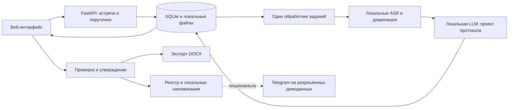

# MVP за 4 часа: локальный протокол и контроль поручений

Статус: исходный план; начаты заготовки реализации, интеграция и реальный inference ещё не подтверждены. План рассчитан на 3 разработчиков; время обработки пока не измерено.

Актуализация после уточнений команды: у пользователя Mac M2 с 8 GB RAM; по его сообщению организаторы разрешили обработку тестовых записей на самостоятельно развёрнутых моделях в Brev. Скриншот подтверждает баланс Brev Compute $50. Основной ML-профиль — GPU в Brev, Mac используется для разработки и веб-интерфейса. Разрешение не распространяем автоматически на готовые внешние inference API или Telegram. Подробное распределение работы: [участник 1 — ML/GPU](tasks/01_ML_GPU.md), [участник 2 — backend](tasks/02_BACKEND_INTEGRATION.md), [участник 3 — UI/демо](tasks/03_FRONTEND_DEMO.md). Текущий согласованный формат обмена — [contracts/README.md](../contracts/README.md); он имеет приоритет над эскизами форматов и путей в исходном плане ниже.

## 1. Решение и ограничения

Продукт: помощник секретаря, который превращает запись встречи в проверяемый протокол и реестр поручений. Для каждого поручения сохраняет исходные реплики, ответственного, срок и неоднозначности. Секретарь проверяет результат, утверждает его и контролирует исполнение.

Из ТЗ: запрещена передача аудио и текста внешним облачным API, требуется локальная/self-hosted обработка. Это касается и распознавания, и извлечения поручений, и саммари. OpenAI/NVIDIA API credits не используем в основном пайплайне. Наличие API credits само по себе не даёт доступ к собственному GPU-серверу.

Основной режим работает без исходящего интернета после предварительного скачивания зависимостей и моделей. Telegram отключён. Для публичного демо допустимость отдельного Telegram-режима на вымышленных данных необходимо уточнить у организаторов; разрешение синтетических записей в ТЗ само по себе не отменяет запрет внешних API.

Вход через загрузку записи позволяет работать с материалами разных платформ, но НЕ является автоматическим подключением участника к Teams/Zoom/Meet. Формулировка раздела «Вход» допускает неоднозначность: уточнить у организаторов, достаточно ли записи. До ответа не заявлять поддержку автоподключения. Если оно обязательно, объём четырёхчасового MVP требует пересмотра.

## 2. Приоритеты под оценку

| Критерий | Вес | Что показать |
| --- | ---: | --- |
| Соответствие и работоспособность | 25 | Реальный путь от аудио до транскрипта, поручений и DOCX; русский, казахский, смешанная речь; диаризация |
| Техническая реализация | 25 | Локальные модели, согласованный формат данных, обработка ошибок, связь поручения с источником |
| README и воспроизводимость | 25 | Проверенная инструкция запуска, версии моделей, подготовка весов, пример входа/выхода, известные ограничения |
| Ценность и применимость | 15 | Проверка секретарём, исправление ответственного/срока, статусы и напоминания |
| Развитие и оригинальность | 10 | Проверяемые поручения, объяснение неоднозначностей, план интеграций и закрытого контура |

Первые 75 баллов важнее дополнительных интеграций. Баллы не гарантированы: таблица показывает соответствие плана критериям, а не прогноз оценки.

## 3. Объём MVP

Обязательно:

1. Загрузка аудио/видео, дата встречи, часовой пояс, список участников и их роли.
2. Уведомление пользователя о записи/ИИ-обработке; для живой записи — подтверждение, что участники уведомлены.
3. Локальное распознавание с временными метками и диаризацией.
4. Сопоставление Speaker A/B/C с участниками: предложения по контексту плюс подтверждение секретаря. Не выдавать диаризацию за биометрическую идентификацию.
5. Саммари по темам, решения, поручения с ответственным и сроком.
6. Редактирование спорных полей, переход к реплике/фрагменту записи, утверждение версии протокола.
7. Экспорт DOCX. PDF — следующий приоритет; в ТЗ «PDF/DOCX», рабочее допущение — один формат достаточен, это стоит уточнить.
8. Реестр: в работе / выполнено, признак просрочки, локальные уведомления о приближении срока и просрочке.

После работающего основного пути: Telegram на разрешённых демонстрационных данных; запись вкладки браузера на одной проверенной комбинации браузера и ОС; PDF.

За пределами четырёх часов: бот-участник сразу для трёх платформ, нативные приложения, потоковое распознавание в реальном времени, СЭД, голосовые отпечатки, RAG/векторная БД, обучение модели, микросервисы и сложная ролевая модель.

## 4. Архитектура

Модульный монолит: React + TypeScript + Vite для веб-интерфейса; Python + FastAPI для приложения; SQLite для данных и очереди; локальная папка для записей и экспортов. Один обработчик фоновых заданий последовательно выполняет тяжёлые этапы. Redis/Celery не нужны.



Модули с небольшим Interface:

| Module | Interface | Что скрывает Implementation |
| --- | --- | --- |
| Speech | `transcribe(media_path, options) -> Transcript` | Конвертацию, ASR, диаризацию, сопоставление временных интервалов |
| Minutes | `draft(transcript, meeting_context) -> DraftMinutes` | Промпт, локальный inference, проверку JSON, объединение повторов, признаки неоднозначности |
| Meeting | Загрузить, получить состояние, исправить, утвердить | Очередь, сохранение версий, переходы состояний, проверку редактирования |
| FollowUp | Проверить сроки, получить уведомления, завершить поручение | Правила сроков, повторные проверки без дублей, доставку через выбранный Adapter |
| Export | `render(approved_minutes) -> docx_path` | Формат документа, таблицы, кириллицу и казахские буквы |

Основной Seam для параллельной работы — формат `Transcript` и `DraftMinutes`. Не строить абстрактную платформу провайдеров заранее. Разработческий Adapter с fixture нужен для работы UI до готовности ASR, но режим явно помечается как демонстрационный и не подменяет доказательство реального распознавания.

### Профили моделей

- NVIDIA: кандидат ASR — `faster-whisper` с мультиязычным `large-v3`; проверять потребление памяти, при необходимости последовательно выгружать модели. Размер/квантизацию выбрать по короткому замеру.
- Apple Silicon: кандидат ASR — `whisper.cpp` с Metal. Не рассчитывать на CUDA-ускорение `faster-whisper` на Mac. Запуск моделей на хосте; не обещать одинаковую GPU-конфигурацию Docker для Mac и Linux.
- Диаризация: `pyannote/speaker-diarization-community-1` локально. Доступ к весам требует подготовки Hugging Face и принятия условий владельцем аккаунта. Проверить это в первые 15 минут.
- Извлечение: кандидат `Qwen3-8B` в локальном Ollama, квантизованный вариант, JSON Schema, без длинного режима рассуждений. Это гипотеза для проверки на примерах, не доказанная точность на казахском.
- CPU-only: работа возможна в зависимости от выбранных моделей, но без обещания малой задержки. Измерить короткую запись, сократить демо; нельзя заменять провалившуюся диаризацию одним фиктивным спикером и считать требование выполненным.

В README закрепить реально проверенные версии runtime, модели, квантизацию, требования к памяти и команды предварительной загрузки. Производительность полного пайплайна измерять на доступном компьютере.

## 5. Пайплайн данных

1. Проверить формат, размер и длительность записи; сохранить под внутренним ID. Дату встречи вводит пользователь: не подставлять текущую дату в историческую запись.
2. Извлечь звуковую дорожку, подготовить mono PCM 16 kHz. Исходник оставить для прослушивания.
3. Получить транскрипт и интервалы говорящих локально. На ограниченной памяти запускать модели последовательно.
4. Сопоставить слова/реплики с интервалами говорящих. Перекрытия и неоднозначные интервалы помечать; сохранять временные метки исходной записи.
5. Предложить соответствия говорящих участникам. Speaker ID означает голосовой кластер; имя определяется из контекста/списка и подтверждается человеком.
6. Передать локальной LLM транскрипт с ID реплик, дату, часовой пояс и справочник участников. Получить структурированный проект протокола.
7. Проверить схему и ссылки на существующие реплики. Проверка цитат подтверждает происхождение, но не гарантирует правильность смысла: спорные интерпретации требуют проверки.
8. Объединить повторные формулировки одной задачи. Сохранить исходное выражение срока и неоднозначности. Финальное уточнение может менять срок, но противоречие нельзя молча скрывать.
9. Секретарь проверяет имена/сроки и утверждает результат. Отдельно различать говорящего, постановщика и исполнителя.
10. Экспорт и напоминания строятся из одной утверждённой версии данных. Повторное открытие страницы не создаёт новые поручения и уведомления.

Казахский и смешанная речь: использовать мультиязычную модель без жёсткой установки `ru` на всю запись. Сделать отдельные короткие тесты RU, KZ и RU/KZ; проверить сохранение имён, чисел, отрицаний, исполнителей и дат. Наличие языка в списке модели не является доказательством качества. В режиме ASR не включать перевод на английский.

## 6. Общий формат данных — согласовать за первые 15 минут

```text
Meeting:
  id, title, occurred_at, timezone, participants[], processing_status,
  error_code?, error_message?, approved_revision?

TranscriptSegment:
  id, start_ms, end_ms, speaker_id, text

Participant:
  id, display_name, role?, aliases[], speaker_id?, identity_confirmed

ActionItem:
  id, meeting_id, title,
  assignee_kind: person | department | unresolved,
  assignee_id?, assignee_label, issuer_id?,
  due_text?, due_kind: date | range | event | unspecified,
  due_date?, due_start?, due_end?, due_event?,
  evidence_segment_ids[], review_reasons[],
  approval: draft | approved,
  status: open | done,
  completed_at?, revision

DraftMinutes:
  meeting_id, topics[], summary, decisions[], action_items[], warnings[]
```

Все nullable-поля реально могут быть пустыми. Для срока «после совещания с подрядчиками» сохраняется событие; для «на следующей неделе» — диапазон или исходный текст с запросом уточнения, а не выдуманный день. Для «15 октября» без известного года/даты встречи нужна проверка. Просрочка рассчитывается только для подтверждённого конкретного срока либо явно принятого правила окончания диапазона.

Не показывать придуманный процент уверенности LLM. Вместо него — причины проверки: «имя не сопоставлено», «срок относительный», «срок не указан», «несколько возможных исполнителей».

HTTP Interface:

- `POST /meetings` — файл и контекст; сразу возвращает ID задания.
- `GET /meetings/{id}` — состояние, транскрипт, проект/утверждённый протокол.
- `PATCH /meetings/{id}` — исправления участников и поручений с номером версии.
- `POST /meetings/{id}/approve` — утвердить проверенную версию.
- `GET /meetings/{id}/export.docx` — экспорт утверждённой версии.
- `GET /actions` и `PATCH /actions/{id}` — реестр и изменение статуса.
- `GET /notifications` — локальные напоминания.

Состояния задания: `queued -> transcribing -> diarizing -> extracting -> review_ready`; ошибка — `failed` с указанием этапа. Состояние утверждения отдельно от состояния обработки. UI опрашивает состояние раз в несколько секунд. В SQLite сохранять этапы; после перезапуска прерванное задание можно явно повторить, не обещая сложное автоматическое восстановление.

## 7. Telegram и кроссплатформенность

Telegram — отдельный Adapter, по умолчанию выключен. В закрытом контуре уведомления остаются в приложении. Даже обезличенное уведомление наружу требует согласования политики; не называть включённый Telegram полностью офлайн-режимом.

Привязка в демонстрационном режиме: секретарь создаёт участника → приложение выдаёт одноразовую ссылку `/start <token>` → пользователь сам открывает бота → сохраняется связка participant_id, Telegram user_id и private chat_id. Username не является надёжным ключом и не позволяет боту первым начать личную переписку.

После утверждения: уведомление о назначении; затем напоминание перед сроком и при просрочке; кнопка «Выполнено». Проверять, что callback пришёл от привязанного исполнителя. Ключ дедупликации: поручение + версия срока + тип уведомления. Сбой отправки не отменяет утверждение протокола. Токены и ссылки на приватные данные не включать в публичные материалы.

На демо с вымышленными данными можно показывать текст поручения. Для реального применения предпочтение — нейтральное уведомление и переход в защищённое приложение, если такой внешний канал разрешён заказчиком.

Кроссплатформенность MVP: веб-интерфейс + импорт аудио/видео, выгруженного из платформы. Запись вкладки браузера — дополнительная возможность после проверки конкретного браузера/ОС; системный звук доступен не везде, микрофон организатора может требовать отдельного захвата. Это не эквивалент универсальному боту-участнику.

## 8. Разделение работы на троих

| Участник | Ответственность | Файлы | Условие готовности |
| --- | --- | --- | --- |
| A — ML | ASR, диаризация, извлечение, сверка с примерами | `backend/app/speech/`, `backend/app/minutes/`, `eval/` | Реальное аудио превращается в валидный DraftMinutes; известные ошибки описаны |
| B — Backend и интеграция | Контракт, FastAPI, SQLite, задания, DOCX, уведомления, опциональный Telegram | `backend/app/meetings/`, `backend/app/followup/`, `backend/app/export/`, `contracts/`, конфигурация запуска | Полный путь загрузка → утверждение → экспорт, данные сохраняются |
| C — UI и демонстрация | Загрузка, прогресс, транскрипт, редактор, реестр, README и сценарий защиты | `frontend/`, `README.md`, `docs/demo.md` | Понятное демо без терминала; запуск воспроизведён по README |

Каждый работает в своей ветке и своём клоне/worktree. B отвечает за интеграцию и изменение общего контракта, A/C согласуют изменения через него. Слияния небольшими готовыми частями в контрольные моменты. Кодекс используется каждым участником для своей зоны; не поручать трём сессиям одновременно менять общие файлы. Реальные закрытые записи и тексты не передавать облачным помощникам разработки.

## 9. Таймбокс 240 минут

| Время | A — ML | B — Backend | C — UI/демо |
| --- | --- | --- | --- |
| 0–15 | Проверить железо и доступ к весам, начать загрузку | Зафиксировать схему и каркас, общую команду запуска | Каркас страниц и согласованная fixture, README-скелет |
| 15–45 | ASR + диаризация на 30–60 сек | Загрузка, сохранение, состояния заданий | Загрузка, прогресс, просмотр транскрипта |
| 45–75 | Локальная LLM → JSON из текста примера | Подключить реальные результаты Speech/Minutes | Редактор ответственного/срока и цитаты |
| 75–120 | Прогон первой полной записи, исправление ошибок | Утверждение и DOCX | Подключить реальные данные, реестр |
| 120–165 | Второй пример + RU/KZ/смешанная запись | Локальные напоминания, защита от дублей; Telegram только если основа готова и допустим | Статусы, ошибки, оформление, снимки для README |
| 165–210 | Измерить качество и задержки, зафиксировать ограничения | Проверить запуск и сохранение после перезапуска | Пройти README на другой машине, подготовить 3-минутную защиту |
| 210–240 | Только исправления | Только исправления | Репетиция, резервная запись демо |

Контрольные точки:

- 45 минут: короткое аудио распознано локально, диаризация возвращает реальные интервалы. Если нет — вся свободная мощность команды направляется на этот риск, дополнительные функции замораживаются.
- 75 минут: UI получает реальный результат через backend. Fixtures больше не считаются интеграцией.
- 120 минут: есть первый DOCX из реальной записи. Если нет — убрать Telegram, browser capture, PDF и декоративные функции.
- 165 минут: обязательный сценарий работает; новые функции прекращаем.
- 210 минут: код и зависимости зафиксированы, только исправления демонстрационного сценария.

Риск: на участнике A самый тяжёлый критический путь. Поэтому B готовит контракт/валидацию и обвязку, C — ручные проверочные кейсы и разметку. Скачивание моделей начинается сразу, до оформления интерфейса.

## 10. Что проверять на предоставленных примерах

Документы прочитаны полностью. Аудио открыто в Google Drive: №1 — 4:34, №2 — 3:26. Самостоятельная транскрибация и проверка акустического качества пока не выполнялись.

- Пример 1: в саммари 10 строк поручений по двум темам. Повтор в финальном подведении итогов не должен создавать дубли.
- Пример 1: обсуждение «две недели → три недели → к 15 октября» должно приводить к согласованному сроку, а не трём поручениям.
- Пример 1: «юридический департамент» — допустимый исполнитель типа department; нельзя автоматически подставлять человека.
- Пример 2: в саммари 6 строк, часть объединяет несколько действий. При оценке сопоставлять смысловые обязательства, а не требовать ровно шесть объектов.
- Пример 2: претензию готовит Ерлан, который не выступает; не назначать её автоматически говорившей Ботагоз. Краткое финальное резюме руководителя может создавать неоднозначность — показать источники и предложить проверку.
- Пример 2: справка нужна после встречи с подрядчиками; конкретная дата не названа.
- Пример 2: срок уведомления и шаблона договора не указан; нельзя его придумывать.
- Пример 2: срок сметы — неделя, закрытия очереди на обучение — месяц. Не терять различие из-за объединённой строки саммари.

Оба текстовых примера русскоязычные. Для обязательных KZ и RU/KZ нужны отдельные короткие записи с известным сценарием, минимум двумя голосами, именами, числом и сроком. Использовать вымышленные данные.

Проверять отдельно извлечение из эталонного текста и полный путь из аудио: так видно, где ошибка — ASR, диаризация или извлечение. Эталонное саммари не передавать модели как часть входного транскрипта.

Минимальный отчёт: найденные/пропущенные/лишние поручения, корректность исполнителя и срока, несколько вручную проверенных интервалов спикеров, полное время обработки и модель/железо. Не объявлять лабораторные проценты по одной записи общей точностью продукта.

Функциональные проверки: отсутствующий срок остаётся пустым; неизвестное имя не превращается в известного участника; один повторный запуск не дублирует уведомления; выполненная задача не становится просроченной; DOCX открывается и содержит казахские буквы; после отключения сети подготовленный основной пайплайн работает.

## 11. Сценарий защиты на 3 минуты

1. Объяснить ценность: потерянные поручения и ручная работа секретаря.
2. Загрузить короткую RU/KZ-запись с двумя голосами и реальными для демо неоднозначностями.
3. Показать транскрипт, говорящих, задачи и переход к доказательной реплике.
4. Исправить/подтвердить участника и спорный срок, утвердить протокол.
5. Скачать DOCX, открыть реестр, отметить задачу выполненной; показать локальное напоминание на отдельном подготовленном кейсе.
6. Показать измеренные результаты двух предоставленных записей, команду запуска, отсутствие внешнего inference.

Заранее обработанные примеры и видеозапись — резерв. Явно называть их сохранённым результатом; не выдавать за текущую обработку. Если длительность inference больше времени защиты, показать запуск и отдельно ранее полученный результат с указанием измеренного времени.

## 12. Что нужно уточнить

1. Железо команды: NVIDIA/VRAM либо чип Mac/RAM, доступный сервер. Это главный технический вопрос перед окончательным выбором моделей.
2. У организаторов: импорт записи достаточно ли закрывает раздел «Вход»; достаточно ли DOCX; допустим ли Telegram на вымышленных данных как отдельный внешний режим.
3. Какие навыки у участников: распределение A/B/C можно поменять, ответственность за модули должна остаться однозначной.

До уточнений план исходит из одного доступного компьютера для локального inference, импорта записи, DOCX и отключённого Telegram. Успеть за четыре часа реалистично только при раннем успешном запуске моделей; универсальное автоподключение к встречам в этот объём не входит.

## Источники

- [Задание и критерии](https://docs.google.com/document/d/1PUDYCg2OC_wfBk4rq5673yc1qsmo8O5_pwxjm483omU/edit)
- [Пример протокола №1](https://docs.google.com/document/d/1umHtiQ4og9i2_8m6fSBulffN5K-0q_pt/edit)
- [Пример протокола №2](https://docs.google.com/document/d/142maSHWfO83yFB4mNtZ8AMJiI_y0NBJb/edit)
- [Аудио №1](https://drive.google.com/file/d/1qfaLjTt7wasq6wX9mWNfIQKdyND6z-tC/view)
- [Аудио №2](https://drive.google.com/file/d/1EUb4ahU4mRcu5jQ6k46Fp_qGSuVf2yh2/view)
- [faster-whisper: локальное выполнение, CPU/CUDA, timestamps](https://github.com/SYSTRAN/faster-whisper)
- [whisper.cpp: Apple Silicon/Metal и другие платформы](https://github.com/ggml-org/whisper.cpp)
- [pyannote community-1: подготовка и офлайн-режим](https://huggingface.co/pyannote/speaker-diarization-community-1)
- [Qwen3-8B: карточка мультиязычной модели](https://huggingface.co/Qwen/Qwen3-8B)
- [Ollama: структурированный вывод](https://docs.ollama.com/capabilities/structured-outputs)
- [Telegram: бот не начинает личный диалог первым](https://core.telegram.org/bots)
- [MDN: ограничения захвата экрана и аудио](https://developer.mozilla.org/en-US/docs/Web/API/MediaDevices/getDisplayMedia)
